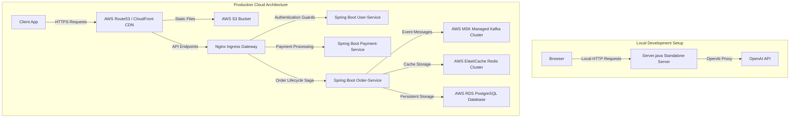

# Production Deployment Architecture Guide

This document outlines the deployment strategy for the Delivo Super Platform.

---

## 1. Dual Deployment Architecture

To balance development velocity and enterprise reliability, Delivo utilizes a dual deployment architecture:

---

## 2. Local Prototype Server (`Server.java`)
The local server is optimized for standalone pair-programming testing without external system dependencies:
*   **Virtual Threads Executor**: Spawns light threads per request, ensuring high concurrency locally.
*   **Server-Side Includes (SSI)**: Automatically compiles frontend components (`/frontend/components/*.html`) dynamically into `index.html` on delivery.
*   **Secure API Proxying**: Routes chat queries to OpenAI, preventing key exposure. Key loaded via:
    `System.getenv("OPENAI_API_KEY")`

---

## 3. Production Pipeline (Kubernetes & AWS EKS)

Production services are fully containerized using Multi-stage Gradle Docker builds:
1.  **Registry Hosting**: Docker containers are compiled and pushed to AWS ECR.
2.  **Orchestrator Orchestrations**: Kubernetes manifest deployments deploy containers to AWS EKS cluster nodes.
3.  **State Logs CDC**: Change Data Capture processes (Debezium engine) capture commits from PostgreSQL master logs and publish event streams to Kafka topics.
