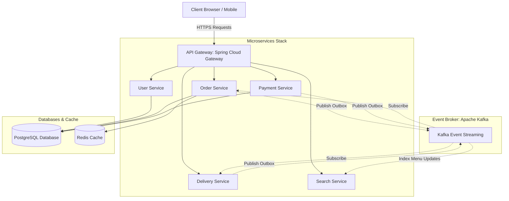
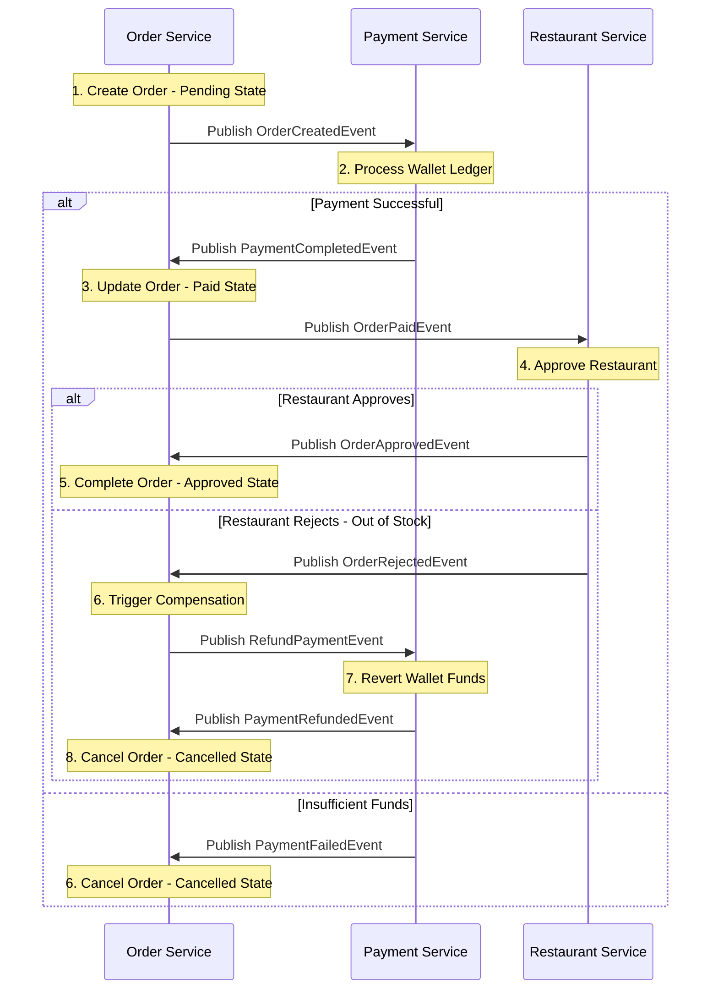

# Delivoos - Enterprise Food Delivery & Logistics Platform

[](https://www.oracle.com/java/)
[](https://spring.io/projects/spring-boot)
[](https://kafka.apache.org/)
[](https://www.postgresql.org/)
[](https://kubernetes.io/)

Delivoos is a production-grade, FAANG-level enterprise food delivery and real-time logistics platform. Designed using Domain-Driven Design (DDD), Hexagonal (Ports & Adapters) Architecture, Event-Driven Sagas, and Transactional Outbox patterns, the system is architected for absolute consistency, high throughput, and fault tolerance across multi-region transactions.

---

## 🏗️ System Architecture

The platform utilizes a microservices architecture coordinated via Event-Driven Choreography over Apache Kafka and routed through an API Gateway:



---

## 🛠️ Technology Stack

* **API Gateway & Routing**: Spring Cloud Gateway, Netty.
* **Core Microservices**: Spring Boot 3.3.2, Java 17/21, Spring Data JPA.
* **Data Stores**: PostgreSQL (Transactional Ledger), Redis (Cache & Active Sessions), Elasticsearch (Catalog Search).
* **Message Broker**: Apache Kafka (Distributed commit log, event streaming).
* **Frontend client**: Vanilla HTML5, Modern CSS3 (featuring premium capsule layouts & liquid transitions), JavaScript (Assembled via Virtual Threads SSI).
* **DevOps & Cloud**: Docker, Kubernetes (zone-aware AntiAffinity configurations), Prometheus, OpenTelemetry, Grafana.

---

## 💡 Architectural Deep-Dive & Challenges Solved

### 1. Distributed Transaction Consistency via Saga Pattern
In a distributed microservice environment, maintaining ACID transactions across separate databases (e.g. Order DB and Payment DB) is a key challenge. Delivoos solves this using **Event-Driven Saga Orchestration**:


* **Happy Path**: Order Placed $\rightarrow$ Wallet Charged $\rightarrow$ Kitchen Accepts $\rightarrow$ Dispatched.
* **Compensation Path**: If the kitchen rejects an order (e.g., out of stock) or a network timeout occurs, a compensation Saga is triggered. The Payment Service automatically reverses the ledger transaction, rolls back wallet credits, and releases reserved stock.

### 2. Reliable Event Delivery via Transactional Outbox Pattern
To prevent "dual-write" bugs where a database write succeeds but publishing the corresponding event to Kafka fails (or vice versa), the system implements the **Outbox Pattern**:
1. Business data updates and event payloads are committed **atomically** in the same local database transaction (writing to business tables and an `outbox` table).
2. An asynchronous scheduler polls the `outbox` table, publishes the message to Kafka, and marks the outbox row as processed upon acknowledgment.
3. This guarantees **Exactly-Once processing** and ensures ultimate data consistency.

### 3. Hexagonal (Ports & Adapters) Architecture
To keep business logic isolated from database mappings and messaging frameworks, the service modules follow a clean Hexagonal structure:
* **`domain`**: Contains pure business rules, entities (`Order.java`, `User.java`), and interface ports. Zero dependencies on external frameworks like Spring or Hibernate.
* **`application`**: Connects ports to orchestrate business scenarios (services, DTO mappings).
* **`dataaccess`**: Implements repositories and entities mapping domain state to PostgreSQL tables.
* **`messaging`**: Implements consumer listeners and event publishers mapping domain ports to Kafka topics.
* **`container`**: Bootstraps the application, loading configurations and launching the Spring Boot runtime.

### 4. Real-Time Tracking & GPS Simulation
* The client tracks delivery couriers dynamically via a lightweight geohash polling system.
* Courier locations are simulated using interpolation vectors on the frontend map.
* Unrealistic distance telemetry coordinates are calculated and scaled within a local delivery radius (1.2 to 14.8 km) using Haversine formulations to maintain realistic system status.

---

## 🚀 Local Development Setup

### 1. Infrastructure Stack (Docker Compose)
Spin up PostgreSQL, Kafka, Redis, and Elasticsearch clusters locally:
```bash
docker-compose up -d
```
* **PostgreSQL Port**: `5432`
* **Redis Port**: `6379`
* **Kafka Broker Port**: `9092`
* **Elasticsearch Port**: `9200`

### 2. Run the Prototyping Dev Server
For rapid prototyping without microservices running, boot the lightweight standalone prototyping server. This serves the dynamic frontend (assembling Server-Side Includes) on port 8080:
```bash
# Compile and run
javac Server.java
java Server
```
Navigate to **`http://127.0.0.1:8080/`** to explore the application interface.

### 3. Run the Spring Boot Services
To run the enterprise Spring Boot REST API gateway and business services:
```bash
# Navigate to backend Maven project
cd backend
mvn spring-boot:run
```

---

## 📦 Kubernetes Production Manifests
Production deployment configurations are located in `infrastructure/k8s/`. Deploy the namespace stack to AWS EKS:
```bash
kubectl apply -f infrastructure/k8s/food-delivery-manifests.yaml
```
Key production capabilities configured:
* **Horizontal Pod Autoscaling (HPA)** based on CPU/memory thresholds.
* **Pod Anti-Affinity** policies preventing single points of failure across AZs.
* **Network Policies** blocking direct access to database configurations from untrusted pods.
